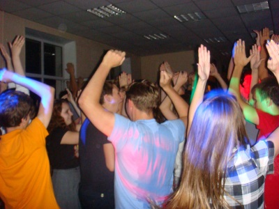

Title: Дискотека
Date: 2015-12-31
Category: Досуг
Author: SuncGuards

Дискотека – это слово наполняет счастьем и благоговейным трепетом практически каждого ученика Сунца, конкретнее, человек 30, которые ходят на них. Причём дискотеки не такие уж и плохие...

В распоряжении сунцов есть 3 колонки, стробоскоп и куча стареньких проводов и пультов. Дискотеки обычно проходят с 21:00 до полуночи, хотя в особых случаях её разрешают проводить до 02:00\. Место проведения – холл учебного корпуса( в тесноте, да не в обиде). Количества представителей обоих полов примерно равны.Сами сунцы грациозно и плавно размахивают конечностями под громкую ритмичную музыку. Особенно «зашедшие» треки ставят по второму разу минут через 30\.

*   **Медляки**

    Теперь про медляки: парни разбирают девушек на основе двух параметров: симпатичность и расстояние до объекта. Сам танец представляет собой равномерные покачивания с оборотами вокруг вертикальной оси, при этом нужно постараться не задеть другие пары. Обязательно найдутся два хлопца с крайне оригинальными шутками, которые образуют пару и начнут выделывать па. Количество парней и девушек, отстаивающих у стеночки медляки, по официальной статистике составляет в среднем 11,3%. Если на дискач пришла пара, состоящая в отношениях, то по сунцовскому этикету они танцуют только друг с другом.

*   **Интересные наблюдения**

Более продвинутые юзеры дискотеки имеют право подойти к диджею и заказать следующий трек, который уж точно раскачает толпу. Всеобщее порицание и изгнание с дискотеки можно получить, задев провод от колонки и остановив музыку. Если на дискаче оказывается именинник, то его друзья, если они есть, отнимут у диджея микрофон и поздравят его, а при наличии физической силы даже будут подкидывать его в воздух, пока их не остановит дежурный воспитатель.

**В сухом остатке**, дискотеки в сунце долгожданны в узком кругу, но хочется, чтобы круг был шире. Это действительно поднимает настроение и служит своего рода эмоциональной разрядкой. Короче, **ходите на дискачи**!