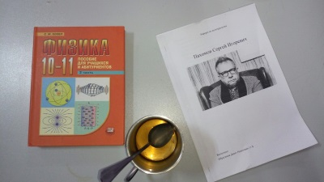

Title: Спецкурсы
Date: 2010-12-03 10:20
Category: Учеба

 

В СУНЦе действует система спецкурсов, согласно которой ученик должен посещать и сдавать зачёт хотя бы одного спецкурса, конечно, профиля школы. И формально это носит обязательный характер, но фактически за этим никто не следит. Лишь однажды нас зачем-то заставили заполнить Google-формы, но ничего не изменилось. В спецкурсах чётко прослеживаются два направления:

*   **Олимпиадно-обучающие**

Здесь вроде всё очевидно. Нужно выбрать парочку кружков, в которых будет идти подготовка к олимпиадам или ЕГЭ. Легко заметить, что количество посетителей падает по экспоненте в ближайщие сроки от начала учебного года, и объяснить это можно тем, что люди определяются с вектором своего развития и отсеивают лишнее, ну или просто ленятся. В любом случае, посещение спецкурсов действительно ощутимо влияет на уровень подготовки, и, по-моему, эффективнее самоподготовки (которая, как известно, проходит параллельно с просмотром видосов и ответами на сообщения).

*   **Внеучебная деятельность**

В этом разделе всевозможные спортивные секции, клубы по интересам и прочие интересные занятия. Наибольшей популярностью пользуется киноклуб, проходящий по субботам в актовом зале, дающий возможность ознакомиться с шедеврами мирового кинематографа и громкими новинками. В конце года нужно будет сдавать реферат о личности, так или иначе внёсшей вклад в развитие кинематографа. Спецкурсы такого рода предоставляют возможность обогатиться духовно, прекратив нарушение гармонии развития личности из-за углубления в изучении конкретных предметов и пренебрежения искусством, и получить эстетическое удовольствие. Спортивные секции также необходимы, иначе как разогнать кровь по телам вечно ботающих сунцов? Короче, многостороннее развитие рулит!

**В общем**, сунцовские спецкурсы позволяют неслабо подготовиться к нужным вещам при должном уровне усердия и от скуки не закиснуть. Однозначно, ходить стоит!